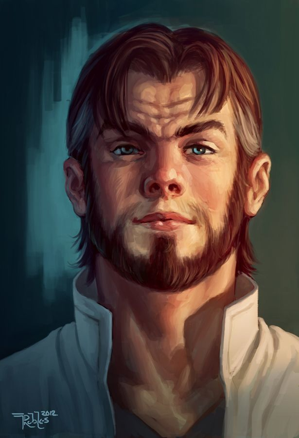
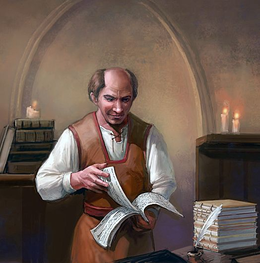

## Factions

- Lords' Alliance: Committed to ensuring the safety of settlements by proactively dealing with dangers.
- Harpers: 
- Zhentarim
- Order of the Gauntlet: Devout and vigilant group smite evil, enforce justice, etc. Retribution against those who cause harm to others.

## NPCs

### Gundrun Rockseeker
 ![[Gundrun-Rockseeker.png]]
- Historic links to characters
- Source of info - spill the beans on the status quo in Phandalin
- Longer term engagement around Gundrun's operations
- Mention the orc raiders - payment!
- Goblins have been ambushing people
- Gundrun covered for Will

### Toblen Stonehill:

- Short, friendly, human in his 30s. 
- Came from Triboar a few years back to be a prospector. Realised after the first two months that he knew a lot more about running an inn that he did about mining.

- Wants to:
    - See the Redbrands gone. He doesn't like how they terrorise the town (bad for business, but he also just doesn't like it)
    - Unhappy that townmaster Harbin hasn't sorted it out.
    - Won't do anything himself, scared of reprisals to his wife and kids.

Todo - Name of wife and kids

### Elmar Barthen

- Len and balding. 50 or so. Kindly.
- Two clerks Ander and Thistle who help in the shop.
- Owns trading post. Pays reward for delivery.
- Gundren is a friend. He is excited about the mine discovery.
- If he learns of Gundens capture he urges the players to help.
- Concerned about how redbrands affect business, town loaw and order. 
- Tells players they are to be found at the sleeping giant inn.
- Int check for background deets (DC 15)
- Nundro and Tharden are camped somewhere outside of town, but he hasn't seen them in a tenday or more, expects them any day for supplies.

### Daran Edermath*
![[Daran-Edermath.jpg]]
- Lean, silver haired fighter. Half elf, over 100.
- Served as a marshal and herald ont he Dragon Coast
- Order of the gauntlet. Orchard keeper, former adventurer.
- Will be unhappy with Will and Ruaidhri if he can thell they are evil
- Concerned about the redbrands. Someone should stand up to Glasstaff.
- Knows the Redbrands hang out at the sleeping giant inn.
- Knows their base is under Tresendar Manor, ruins at the east of the town.

### Linene Graywind
- Runs a trading post (Lionshield Coster). reward for supplies

### Halia Thornton*
- Zhentarim

### Qelline Alderleaf
- Helpful farmer. Son knows secret way to redbrands camp.

### Sister Garaele*
- Harper Agent. Elf Cleric. Shrine of Luck.

### Harbin Wester
- Townmaster

### Sildar Hallwinter* 

![[Sildar-Hallwinter.jpg]]

- Member of the Lord's alliance.
- Kind hearted, 50 years old
- Good guy
- Met Gundren in Neverwinter and agreed to accompany him to Phandalin
    - Wants to:
        - Help Gundren reopen the mine
        - Find Iarno
        - Restore Phandalin to it's former glory
    - Tells Players:
        - The bros. recently located an entrace to the lost Wave Echo Cave, site of the Phandelver Pact
        - He knows that Klarg was acting under orders, having overheard the goblins mention that the Black Spider asked the dwarf to be brought to him at Cragmaw Castle.
        - Gundren had a map of the location of the enttrance, but it has been taken. He suspects both have been sent to Cragmaw Castle.
        - Iarno was his contact in Phandalin. Iarno arrived two months ago, but Sidlar has heard nothing form him. And hence came to investigate.
    - Wants players to escort him to Phandalin (50gp reward)
- Gundren Rockseeker
- Nundro and Tharden

### Rygoth the Druid (Emerald Enclave)

### ?? Glasstaf

### Iarno Albrek:
- Lords Alliance
- Friend of Sildar
- Missing

### Neznar the black spider
